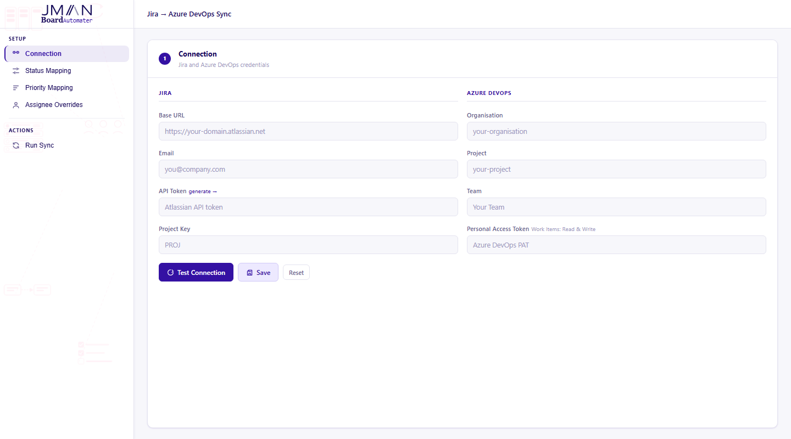
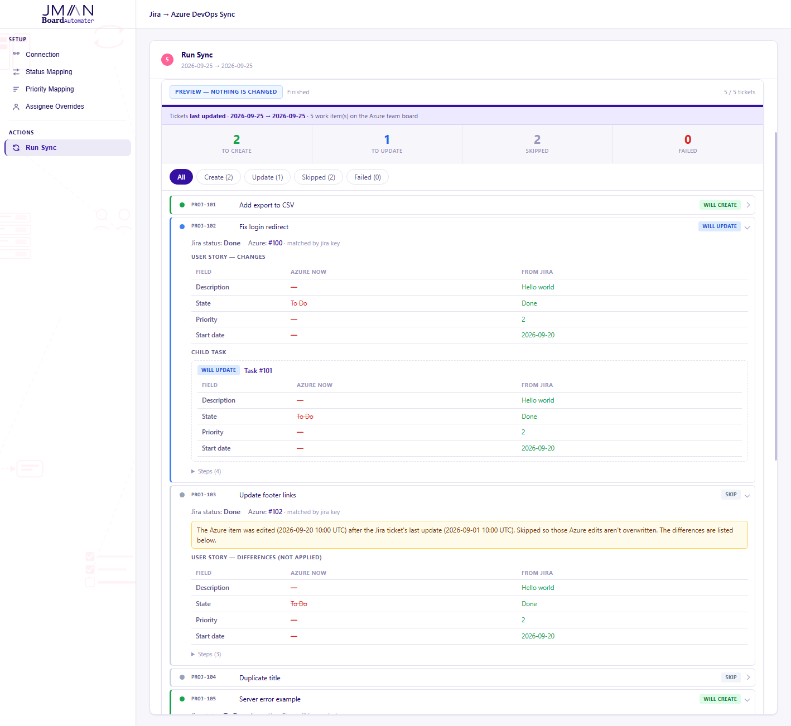

# Board Automater

Board Automater saves you time on the repetitive work of moving tasks and tickets from one board to another, for example from Jira to Azure DevOps.

It comes with a simple UI, so it's easy to use. Give it a try.





## Run it

Clone the repo and go into its folder:

```sh
git clone https://github.com/jmd430-dhanushr/board-automater.git
cd board-automater
```

### Option 1: Docker (recommended)

```sh
docker compose up --build
```

### Option 2: Without Docker

If you don't have Docker, you'll need [Python 3.11+](https://www.python.org/downloads/) and [Node.js 22+](https://nodejs.org/).

```sh
cd frontend
npm ci
npm run build
cd ..
pip install -r requirements.txt
uvicorn app.main:app
```

This builds the UI once, then starts the backend, which serves both the UI and the API.

Either way, open http://localhost:8000, enter your Jira and Azure DevOps credentials, and start syncing.

### Development mode (for changing the code)

Run the backend and the UI in two terminals, both from the repo folder:

```sh
# Terminal 1: backend
pip install -r requirements.txt
uvicorn app.main:app --reload
```

```sh
# Terminal 2: UI with live reload
cd frontend
npm ci
npm run dev
```

Open http://localhost:5173. The UI forwards API calls to the backend on port 8000.

If port 8000 is already used by another app, start the backend on another port and point the UI at it:

```sh
uvicorn app.main:app --reload --port 8001
```

```powershell
# PowerShell
$env:BACKEND_URL="http://localhost:8001"; npm run dev
```

```sh
# macOS / Linux
BACKEND_URL=http://localhost:8001 npm run dev
```

> **Security:** Your credentials are never stored on the server. They stay in your browser's local storage and are only sent with each request to talk to Jira and Azure DevOps.

> **Note:** Always test your connection, run a **Preview**, and check the results before you run a real sync. A sync creates and updates work items on your board, so make sure you're confident in what it will do first. This tool is still maturing and is provided as is, and you're responsible for validating any changes it makes to your boards.
